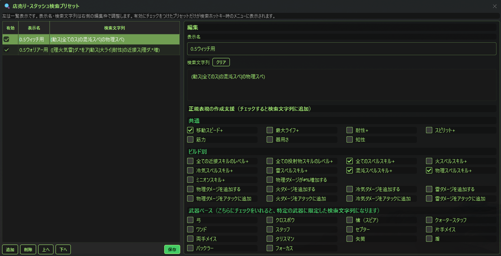

# ぽえなび（PoENavi）

Path of Exile 1 / Path of Exile 2 に対応した軽量なレベリングガイド＆タイマーツール。
**Client.txtログ監視による自動エリア検知**＋**攻略ガイド**＋**マップ画像表示**＋**RTAタイマー**を表示します。

---

## ✨ このツールで出来ること

### 📖 攻略ガイド
- PoE1 / PoE2 のキャンペーン進行に合わせて、エリアごとの**目標・レイアウト情報・Tips**を自動表示
- **マップ画像サムネイル一覧** — クリックで拡大表示（←→キーでページ送り）
- **基本方向矢印** — そのエリアで進むべき方向を大きな矢印で表示
- **経験値効率表示** — 🌟マーク付きで稼ぎポイントがひと目でわかる
- ガイドデータは設定画面からユーザーでも自由に編集可能

※ひな型のガイド情報は、過去に私が作成した攻略チャートをベースにしています。全体の流れを見たい場合はこちらをご確認ください。
- PoE1：https://docs.google.com/spreadsheets/d/1fVbL4CPHUw-5IlHoL0ol--_d-YqYSI3uwbmPLignZ8k/edit?usp=sharing
- PoE2：https://docs.google.com/spreadsheets/d/1dLWs0xZ3gPynItsxzFnshXOZ_ukFzJOXCkgUEVPC-qE/edit?usp=sharing

※**マップ画像サムネイル一覧**の画面イメージはこちら。画像１枚目の赤枠部分がサムネイル表示。画像２枚目がそのうちの１枚をクリックして拡大した状態


※**Act3 / Act8 ルート選択対応**
  - Act3: 通常ルート / 図書館寄り道ルート
  - Act8: 通常ルート / 隠れた裏道ルート
  - 選択ルートに応じて、ガイド・マップ画像・ジェム取得タイミングが切り替わります

### 📍 自動エリア検知 & XPペナルティ判定
- **PoEのClient.txtログをリアルタイム監視** — エリア移動・レベルアップを自動検知
- 各エリアのモンスターレベルをもとに、XPペナルティを3段階で判定

| 表示 | 意味 | 条件 |
|------|------|------|
| 🟢 最適レベル | 余裕あり | キャラLv ≤ エリアLv かつ差が余裕ライン以内 |
| 🟡 ペナルティなし | ペナルティは未発生 | 差がペナルティ範囲内だが最適ではない |
| 🔴 ペナルティ | 経験値が減少中 | 差がペナルティ範囲を超過 |

※画像イメージ：PoE1 Act3の船着き場（Dock）で、エリアレベル29に対して、キャラレベルが24で赤信号が点滅している様子


#### 計算式（PoE公式準拠）

キャラクターレベルとエリアのモンスターレベルの差が一定範囲を超えると、獲得経験値にペナルティが発生します。
参照元：https://www.poewiki.net/wiki/Experience
```
ペナルティ範囲 = キャラLv ÷ 16 + 3（切り捨て）
余裕ライン　　 = キャラLv ÷ 16 + 2（切り捨て）
レベル差　　　 = キャラLv − モンスターLv
```

- **|レベル差| ≤ 余裕ライン** かつ **キャラLv ≤ モンスターLv** → 🟢 最適レベル
- **|レベル差| ≤ ペナルティ範囲** → 🟡 ペナルティなし
  - レベル差が正（キャラが高い）→ 「ややレベル上がり気味」
  - レベル差が負（キャラが低い）→ 「ややレベル不足気味」
- **|レベル差| > ペナルティ範囲** → 🔴 ペナルティ（経験値減少）
  - レベル超過 or レベル不足を表示

例：キャラLv16 → ペナルティ範囲=4、余裕ライン=3

### ⏱️ RTA タイマー
- PoE1: Act 1〜10、PoE2: Act 1〜4 + 幕間1〜3のラップタイム計測
- **自動ラップ機能** — デフォルトF7キーでタイマースタートした後は、各Act/区間クリア時にClient.txtログから自動でラップを記録。
  - 「自動/手動」ボタンで切替可能（初期設定: 自動）

  - 自動モード中もホットキー（F9）による手動ラップは有効（万が一の補正用）
  - 各Act/区間の完了判定タイミング:

**PoE1**

| Act | 完了トリガー |
|-----|------------|
| Act 1 | 南の森（The Southern Forest）に入場 |
| Act 2 | サーン市街（The City of Sarn）に入場 |
| Act 3 | 水道橋（The Aqueduct）に入場 |
| Act 4 | 奴隷収容所（The Slave Pens）に入場 |
| Act 5 | キタヴァ撃破（耐性ペナルティログ検知） |
| Act 6 | 橋の野営地（The Bridge Encampment）に入場 |
| Act 7 | サーンの城壁（The Sarn Ramparts）に入場 |
| Act 8 | 血の水道橋（The Blood Aqueduct）に入場 |
| Act 9 | オリアスの船着場（Oriath Docks）に入場 |
| Act 10 | キタヴァ撃破（耐性ペナルティログ検知） |

**PoE2**

| 区間 | 完了トリガー |
|-----|------------|
| Act 1 | ヴァスティリ郊外（The Vastiri Outskirts）に入場 |
| Act 2 | 砂原の沼地（Sandswept Marsh）に入場 |
| Act 3 | キングスマーチ（Kingsmarch）に入場 |
| Act 4 | Act4ボス後の会話ログを検知 |
| 幕間 1 | ホルテンの豪邸（The Manor Ramparts）に入場後、別幕間の開始エリアに入場した時 |
| 幕間 2 | キーマの貯水池（Keth's Reservoir）に入場後、別幕間の開始エリアに入場した時 |
| 幕間 3 | クアチクの地下避難所（The Quake-Hollow）に入場後、別幕間の開始エリアに入場した時 |
| クリア | ジッグラトの避難所（The Ziggurat Refuge）に入場 |

※PoE2の幕間は攻略順が自由なため、各幕間のボス側エリア到達を「完了候補」として保持し、次の幕間開始エリア（避難所 / カーリバザール / 森の広場）に入った時点でラップを確定します。キャンペーンクリア時に未確定の幕間候補が残っている場合は、先に幕間ラップを確定してからクリアラップを記録します。
- ホットキーでゲーム中もワンタッチ操作
- 半透明オーバーレイ — ゲーム画面に重ねて使える
- ラン記録の自動保存 — `runs/YYYYMMDD_HHMMSS.json` に保存（キャンペーン完了時またはタイマーリセット時）
- **リセット確認ダイアログ** — タイマーリセット時に確認ダイアログを表示し、誤操作を防止（設定でON/OFF可能）
- **タイマー状態の保存・復元** — タイマー停止時に経過時間とラップを自動保存。アプリを再起動しても前回の状態から再開できます

### 🔍 店売り・スタッシュ検索プリセット
- よく使う店売り検索・スタッシュ検索用の文字列をプリセットとして登録できます
- メイン画面の **🔍ボタン** から「店売り・スタッシュ検索プリセット」を開き、表示名・検索文字列・有効/無効を編集
- 検索文字列は手入力のほか、**正規表現の作成支援チェックボックス**でよく使う条件を組み合わせて作成できます

- 検索ホットキー（初期：F4）を押すと、有効なプリセットだけがメニュー表示され、選択した文字列を貼り付けできます
  


- PoE1用プリセットとPoE2用プリセットは別々に保存されます

### 🧪 （PoE1のみ）PoBインポートによるジェム取得リスト
- PoB（Path of Building）のエクスポートコードを読み込み、必要ジェムの取得タイミングを自動表示。
　PoBのコードは以下ボタンから取得のうえ、

　ぽえなびの「PoBインポート」のボタンからコードを貼り付けてください。

- クエスト報酬 / ベンダー購入 / Act6 Lilly 購入を区別して表示
- 現在Actに合わせてジェムリストが自動追従
- ジェム名クリックでPoE内検索欄へ自動で貼り付け可能
- 取得済みチェックは保存され、再起動後も維持されます

### 📐 折りたたみUI
- **タイマー**・**ラップタイム**・**ガイド** の3セクションをそれぞれ個別に折りたたみ可能
- さらにガイド内部も **ゾーン情報**・**ガイドテキスト**・**マップ** を個別に折りたたみ可能
- 例えばマップだけ見たい時はゾーン情報とガイドテキストを畳む、など柔軟にカスタマイズできます
- 使わない部分を畳んで、画面を最小限に — ゲーム画面を邪魔しません
- タイマー・ラップタイム・ガイドの折りたたみ状態は自動保存され、次回起動時も維持されます

※タイマー（赤枠）、ラップタイム（黄色枠）、ガイド（青枠）の部分をクリックで折りたたみ

### ⚡ ログアウトマクロ（TCP切断）
- **F5キー（デフォルト）で高速ログアウト** — PoEクライアントのTCP接続を直接切断し、キャラクターセレクト画面に即座に戻ります
- `/logout`チャットコマンドより圧倒的に速く、HC（ハードコア）プレイにも対応できる速度です
- Windows API による自前実装のため、外部ツール（cports等）のインストールは不要です
- 設定画面からホットキー変更 + ON/OFF切り替え可能
- **⚠️ 管理者権限が必要です** — TCP接続の強制切断にはOSの管理者権限が必要です
  - 右クリック →「管理者として実行」で起動してください（管理者権限なしでもアプリは通常通り動作しますが、ログアウトマクロ使用時にエラーメッセージが表示されます）


### 👆 クリックスルー
- **F6キー（デフォルト）でON/OFF切替** — ぽえなびの上をクリックしても、背後のゲーム画面にクリックが通り抜けます
- フルスクリーンのゲーム画面にオーバーレイ表示しながら、ゲーム操作を妨げません（ただし、ガイドデータのスクロールはできなくなります。スクロールしたい場合は、適宜ON/OFFを切り替えるか、ウィンドウロック機能の活用もご検討ください）
- ホットキーは設定画面から変更可能
- ON時はウィンドウ上部にオレンジ色で「🔓 クリックスルーON（F6で解除）」と表示されます


### 🔒 ウィンドウロック
- 設定画面から「ウィンドウの移動・リサイズを禁止する」をONにできます
- フルスクリーンのゲーム画面にオーバーレイ配置しているとき、誤ってウィンドウを動かしたりサイズを変えてしまうのを防止します
- ロック中もボタン操作やスクロールは通常通り使えます

### 🌐 英語クライアント対応
- 日本語クライアント・英語クライアントどちらでも動作します
- Client.txtのログ出力言語を自動判別し、エリア検知・ガイド表示・マップ画像表示が正しく機能します

### 🔍 透過率設定
- **背景透過率** — 設定画面から背景の透過率を調整可能（5%〜100%）。テキストはくっきりのまま、背景だけを透過
- **文字透過率** — タイマー・ガイド・マップ等のUI全体の透過率を調整可能（0%〜100%）。ゲーム中にガイドを薄く残しておきたい時に便利


### 📝 ゲーム中メモ
- 📝ボタンでフローティングメモ帳を表示 — ゲーム中にサッとメモを残せます
- **色付きテキスト対応** — 7色のカラーパレットで重要な情報を色分け
- メモはPoEバージョン別に `notes_poe1.json` / `notes_poe2.json` へ自動保存 — アプリを閉じても消えません
- フレームレス＆リサイズ可能 — 好きな位置・サイズに配置
- もう一度📝ボタンを押すと非表示に（トグル動作）

### 📋 テキスト選択・コピー
- ガイド表示エリアのテキストをマウスでドラッグ選択 → Ctrl+C でコピー可能
- アイテムフィルター用のRegex等をガイドに書いておけば、すぐコピーして使えます

### 🗺️ マップレイアウト拡大表示
- サムネイルクリックで拡大画像を表示。画像の左右クリックまたは←→キーで画像を切替
- 「エリア移動時にマップレイアウトの拡大画像を自動で開く」設定をONにすると、エリア移動だけで自動表示
- エリア移動時に開いているマップダイアログは自動で閉じます
- 「ぽえなびの隣に自動配置」設定をONにすると、拡大画像がメインウィンドウの隣に表示されます

### 🖥️ マルチモニター対応
- 設定画面から「ぽえなび起動時のウィンドウ配置先」で表示モニターを選択可能
- サブモニターにぽえなびを常駐させ、メインモニターでゲームに集中できます

### 🪶 軽量設計
- **Client.txtが何GBあっても動作に影響なし** — ファイル末尾だけを効率的に読み取り
  - 起動時: 末尾500KBのみスキャンして最新レベル＆エリアを即復元
  - リアルタイム監視: 前回読み取り位置から差分のみ（500msポーリング）
- CPU負荷ほぼゼロ、メモリ使用量最小限

### 🔒 安全性と透明性

#### GGG公式ポリシーに準拠
GGGの[Developer Docs](https://www.pathofexile.com/developer/docs)では、サードパーティツールについて以下のように明記されています：

> **Executable apps that run independently from the game**
> - While not encouraged, these are **permitted**.
> - **Reading the game's log files is okay** as long as the user is aware of what you are doing with that data.

（和訳）**ゲームとは独立して動作する実行ファイル**
- 推奨はしないが、**許可されている**。
- **ゲームのログファイルの読み取りは問題ない**（ユーザーがそのデータの使われ方を認識している限り）。

> **Executable apps that interact with the game or game files**
> - This behaviour is strictly against our Terms of Use.

（和訳）**ゲームやゲームファイルと直接やり取りする実行ファイル**
- この行為は利用規約に**明確に違反**する。

ぽえなびは前者（ゲームと独立して動作し、ログファイルを読み取るだけ）に該当します。

#### ぽえなびが「やること」と「やらないこと」

| ✅ やること | ❌ やらないこと |
|------------|---------------|
| Client.txtログファイルの読み取り | ゲームのメモリ・プロセスへのアクセス |
| エリア移動・レベルアップの検知 | キー入力の自動送信・マクロ操作 |
| ローカルでの情報表示 | プレイデータやログ内容の外部送信 |
| | ゲームクライアントの改変 |
| | パケットの傍受・改ざん |

- **ソースコード完全公開** — 何をしているか誰でも確認できます
- 起動時にGitHub Releasesへ最新バージョン確認を行います（ログ内容やプレイデータは送信しません）
- Exilence Next, Livesplit, PoE Lurker等と同じClient.txtログ読み取りアプローチです
- exe版が不安な方は、このGitHubからソースを取得して直接実行できます

---

## 📥 インストール

### Option A: exe版（推奨 — Pythonインストール不要）
1. [Releases](../../releases) ページから最新の `.zip` をダウンロード
2. 解凍して `PoENavi.exe` を実行

> [!IMPORTANT]
> 解凍ソフトによっては、日本語フォルダ名が文字化けすることがあります。  
> その場合、マップ画像など一部のファイルが正しく読み込めず、アプリ内で画像が表示されない原因になります。  
> 文字化けする場合は、Windows標準の「すべて展開」または日本語ファイル名に対応した解凍ソフトで展開してください。

### アップデート

exe版は起動時にGitHub Releasesの安定版を確認します。新版の通知で「今すぐアップデート」を選ぶと、ダウンロードとSHA-256検証を行い、ぽえなびを終了してファイルを更新した後、自動で再起動します。

通知を閉じた後は、ぽえなびを右クリックして「アップデートを確認」を選ぶと再確認できます。ソースから実行している場合は、自動置換の代わりにReleaseページを案内します。

### Option B: ソースから実行
```bash
git clone https://github.com/buri34/poenavi.git
cd poenavi
pip install -r requirements.txt
python main.py
```

---

## 🚀 使い方

1. アプリを起動
   - 初回起動時にWindows SmartScreenの警告が表示される場合があります。「詳細情報」→「実行」で起動できます（コード署名証明書を使用していないためです）
2. 初回起動時に PoE1 / PoE2 のどちらで起動するかを選択
3. ⚙ボタン（または右クリック →「設定」）→ **基本設定** タブで、選択中モードに対応する `Client.txt` のパスを設定
   - PoE1 Steam版: `C:\Program Files (x86)\Steam\steamapps\common\Path of Exile\logs\Client.txt`
   - PoE1 GGG公式版: `C:\Program Files (x86)\Grinding Gear Games\Path of Exile\logs\Client.txt`
   - PoE1 Epic Games版: `C:\Program Files\Epic Games\PathOfExile\logs\Client.txt`
   - PoE2 Steam版: `C:\Program Files (x86)\Steam\steamapps\common\Path of Exile 2\logs\Client.txt`
   - PoE2 Epic Games版: `C:\Program Files\Epic Games\PathOfExile2\logs\Client.txt`
4. ゲーム内チャットの表示設定で **「ローカル」** を表示ONにする
   - ボスの発言ログを使って、自動ラップや途中の攻略ガイド切り替えを制御している箇所があります。
   - 「ローカル」がOFFの場合、ボス会話が `Client.txt` に出力されず、自動ラップや一部ガイド更新が動かないことがあります。
5. 「保存」→ PoEでプレイ開始！

### PoE1: PoBインポートとジェム取得リスト

PoE1モードでは、Path of Building のビルド情報から、キャンペーン中に必要なジェム取得タイミングを表示できます。

1. PoBでビルドを開く
2. `Import/Export Build` → `Export` → `Copy` でエクスポートコードをコピー
3. ぽえなびの **📥 PoBインポート** をクリック
4. コピーしたコードを貼り付けてインポート
5. ガイド下部に、Actごとのジェム取得リストが表示されます

ジェム名をクリックするとPoEの検索欄へ貼り付けできるため、NPCショップやスタッシュ内検索に利用できます。

### 設定ファイルの保存場所

設定はアプリ本体フォルダではなく、Windowsのユーザーデータ領域に保存されます。

```text
%APPDATA%\PoENavi\config.json
```

これにより、exeを新しいバージョンへ入れ替えても設定を引き継げます。旧バージョンのアプリ本体フォルダに `config.json`、`notes_poe1.json`、`notes_poe2.json`、`vendor_search_presets.json` などがある場合は、PoENavi起動時にまとめて自動移行し、バックアップを `%APPDATA%\PoENavi\` に保存したうえで、旧ファイルは削除します。

PoBインポート結果、ジェム取得チェック状態、PoE1/PoE2別の検索プリセットも `%APPDATA%\PoENavi\` に保存されます。

主な保存ファイル:

- `config.json` — 基本設定
- `pob_import_data.json` — PoBインポート結果・ジェム取得チェック状態
- `vendor_search_presets_poe1.json` — PoE1用店売り検索プリセット
- `vendor_search_presets_poe2.json` — PoE2用店売り・スタッシュ検索プリセット
- `notes_poe1.json` / `notes_poe2.json` — ゲーム中メモ


### ホットキー（デフォルト）
| キー | 機能 |
|------|------|
| F7 | 開始 / 停止 |
| F8 | リセット |
| F9 | ラップ（次のAct/区間へ） |
| F10 | ラップ取消 |
| F5 | ログアウト（TCP切断） |
| F6 | クリックスルー ON/OFF |

※ 設定画面から変更可能

---

## 🗺️ マップ画像

`maps/` フォルダにPoEバージョン別・エリア別のレイアウト画像を配置すると、ガイド画面にサムネイル一覧が表示されます。

### フォルダ構造
```
maps/
  PoE1/
    海岸/           ← エリア名のフォルダ
      layout1.png
      layout2.png
    牢獄 -下層-/
      pattern_a.png
  PoE2/
    クリアフェル/
      layout1.png
```

- フォルダ名 = エリア名（ゾーンデータに登録した名称と一致させる）
- PNG / JPG / GIF / WebP 対応
- サムネイルをクリックすると拡大表示（リサイズ可能、←→キーでナビゲーション）
- 画像は自由に追加・差し替え可能
- PoE1のAct1-5とAct6-10で同名のエリアがあるところは、エリア名の最後に「#2」をつけることで、Act6-10専用のフォルダになります。

---

## ⚙️ ガイド編集

設定画面 → **エリア情報** タブで、選択中のPoEバージョンに対応した各エリアのガイドデータを編集できます。

- **📝 ガイド編集**: 目標・レイアウト情報・Tips・基本方向を編集

---

## 🔁 訪問回数によるガイド切替

一部のエリアでは、同じエリアでも、1回目の到着時と2回目の到着時で表示するガイド内容を切り替える仕組みになっています。
デフォルトでは**キャンペーン進行に沿った1回目到着時のガイド**が表示され、
攻略の流れで別の目的で同じエリアに到着した場合には、2回目到着時のガイドが表示されます。

ただし、リーグ固有のコンテンツなどで想定外のエリア移動が発生すると、不適切な2回目のガイドが表示されてしまうケースがあり得ます。
そのため、UI上の **「自動 / 1回目 / 2回目」ボタン** で手動切替が可能です。

※自動の状態から、赤枠部分を１回クリックで１回目到着時のガイドを表示

- 通常はアプリが訪問回数を自動カウントするため、操作不要です
- 手動で切り替えた場合、次のエリアに移動すると自動的に「自動」に戻ります

## 🔄 PoE1: Act 1-5 / Act 6-10 切替

PoE1ではAct 6-10の一部エリアがAct 1-5と同名で登場します。
このアプリでは正しいAct側のガイドを表示するために、自動切替機能を搭載しています。

| トリガー | 説明 |
|----------|------|
| **Act5クリア（自動）** | Act5ボスを倒したときに出力されるログを検知して自動切替 |
| **エリア検知（自動）** | Act 6-10固有エリアに入場で自動切替 |
| **手動ボタン** | UI上のボタンで手動切替 |

---

### 🛤️ PoE1: ルート選択（Act3 / Act8）
- PoE1のAct3とAct8で複数の攻略ルートに対応
  - **Act3**: 通常ルート（図書館スキップ） / 図書館寄り道ルート
  - **Act8**: 通常ルート / 隠れた裏道（The Hidden Underbelly）ルート
- 初回セットアップ時にルート選択ダイアログが表示されます
- 設定画面からいつでも変更可能
- 選択したルートに応じてガイド内容・マップ画像が自動で切り替わります

## 📝 今後の対応予定

現時点で想定している改良予定内容は以下のとおりです。
みなさんから改善要望をいただいた場合に、優先順位の高いものがあれば、そちらから対応します。
- マップレイアウト画像の充実化

---

## 🧑‍💻 開発者向けリリース手順

1. `src/version.py` の `APP_VERSION` を次の `X.Y.Z` に更新する
2. `python -m pytest -q` を実行する
3. バージョン更新を `main` へマージする
4. 同じコミットへ `vX.Y.Z` タグを作成してpushする
5. `Release Windows App` workflowが成功し、`PoENavi.zip` と `PoENavi.zip.sha256` がReleaseへ添付されたことを確認する

タグと `APP_VERSION` が一致しない場合、workflowはReleaseを作成せず失敗します。

---

## 🛠️ Tech Stack

- Python 3.12+
- PySide6 (Qt6)
- pynput（グローバルホットキー）

---

## 📜 License

MIT License — 詳細は [LICENSE](LICENSE) を参照

---

## 🙏 Credits

- [Path of Exile](https://www.pathofexile.com/) by Grinding Gear Games
- Built with ❤️ by [Buri](https://github.com/buri34)

---

## ☕ サポート

ぽえなびを気に入っていただけたら、応援いただけると嬉しいです。  
いただいたサポートは、開発環境の維持・改善に充てさせていただきます。

- [OFUSE（おふせ）で応援する](https://ofuse.me/48eca107)
- [Ko-fi で応援する](https://ko-fi.com/buri8857)
